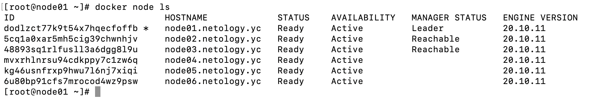
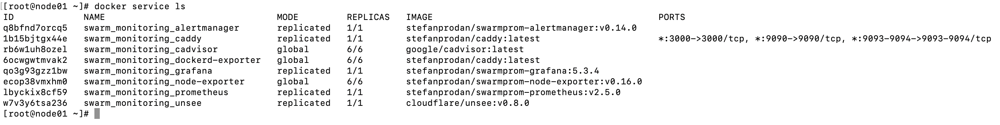

# Домашнее задание к занятию "5.5. Оркестрация кластером Docker контейнеров на примере Docker Swarm"

## Задача 1

Дайте письменые ответы на следующие вопросы:

1) В чём отличие режимов работы сервисов в Docker Swarm кластере: replication и global?
2) Какой алгоритм выбора лидера используется в Docker Swarm кластере?
3) Что такое Overlay Network?

## Ответ:

1) Разница между ниму в том, что replication находится в стольких экземплярах, сколько мы создаем, а в режиме global сервис запускается на всех модах одновременно, обычно он используется для экспортеров чтобы обеспечить мониторинг всего кластера (для всего того чтобы находилась на всех нодах).
2) Если говорить более подробно, то используется так называемый алгоритм поддержания распределенного консенсуса - Ralf.
3) Общий случай логической сети, создаваемой поверх другой сети. Узлы оверлейной сети могут быть связаны либо физическим соединением, либо логическим, для которого в основной сети существуют один или несколько соответствующих маршрутов из физических соединений

## Задача 2

Создать ваш первый Docker Swarm кластер в Яндекс.Облаке

Для получения зачета, вам необходимо предоставить скриншот из терминала (консоли), с выводом команды:
```
docker node ls
```

## Ответ:



## Задача 3

Создать ваш первый, готовый к боевой эксплуатации кластер мониторинга, состоящий из стека микросервисов.

Для получения зачета, вам необходимо предоставить скриншот из терминала (консоли), с выводом команды:
```
docker service ls
```

## Ответ:



